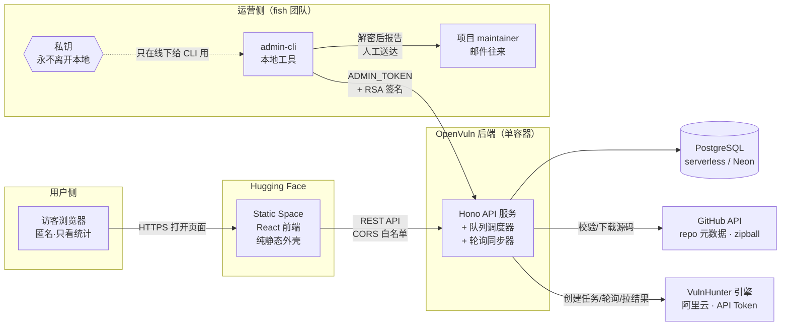
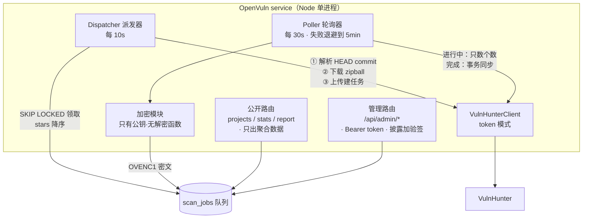
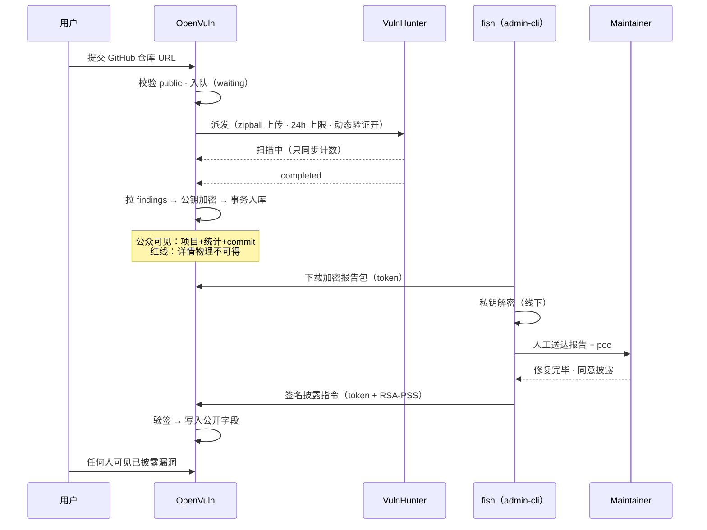
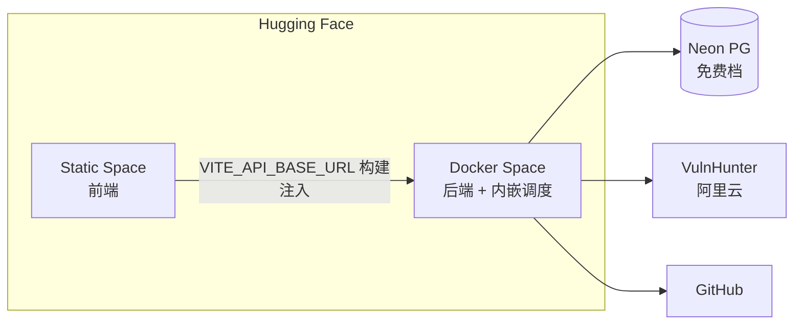

# OpenVuln 整体架构（At a Glance）

> 2026-08-02 ｜ 与 fish 架构讨论的底图 ｜ 详细设计见：architecture-prototype.md / crypto-admin-channel.md / architecture-review.md

## 1. 系统上下文（谁和谁说话）

**一句话**：页面是静态的，数据全是 API 现取的；扫描重活在远端 VH；漏洞详情用公钥加密存库，服务器自己也解不开；披露权在 fish 手里的私钥上。

## 2. 后端内部（单进程里的四个角色）

**关键机制**：
- **队列就在 PG 里**（scan_jobs 表），重启不丢；最多 4 个并发（可动态调）
- **下载自控**：不再让 VH 去 clone（阿里云访问 GitHub 不稳），我们下载 zipball 上传，commit 精确绑定
- **可见性指针**：`projects.current_scan_job_id` —— 公众永远只看最近一次**完成**的扫描；重扫期间旧结果持续可见，完成瞬间原子切换
- **同步事务化**：拉详情（慢）在事务外；删旧→插入→翻指针→标完成在一个事务里 —— 崩溃=回滚=数据和披露决策都安全

## 3. 漏洞数据的旅程（含信任边界）

**三道信任边界**：
1. **公众 ↔ 平台**：公开查询在 SQL 层只 SELECT 聚合列，单条详情物理上取不到（不是"小心不返回"，是"查不到"）
2. **平台 ↔ 漏洞详情**：密文 OVENC1（每条 finding 独立 AES 密钥，RSA 公钥包裹）；服务器被攻破 = 拿到一堆解不开的密文
3. **披露操作 ↔ 伪造**：披露必须附私钥签名；admin token 泄露 ≠ 能披露

## 4. 部署拓扑（目标态）

- 部署所需 secrets（HF 后台配）：`DATABASE_URL` / `VULNHUNTER_*` / `ADMIN_TOKEN` / `ADMIN_PUBLIC_KEY` / `CORS_ALLOWED_ORIGINS`
- **私钥不是 secret，根本不进任何部署** —— 只在 fish 本地
- 后端挂了：队列在 PG，重启自动续跑；VH 挂了：退避轮询，公众页不受影响

## 5. 已知的取舍（诚实清单）

| 取舍 | 理由 | 未来的门 |
|---|---|---|
| 单进程轮询 | 原型规模足够 | SKIP LOCKED 已备好，多实例零改动 |
| info 级不入库统计 | 公众口径四档 NVD | 数据仍在密文里 |
| 产物（poc/exp）文本入库 | 原型不引对象存储 | 量大后迁 S3 兼容存储 |
| 密钥轮换靠重扫重建 | 原型不做在线重加密 | runbook 已留方案 |
| VH failed 宽限 3 轮后标死 | 配合人工恢复运营模型 | 可加自动重试上限 |
